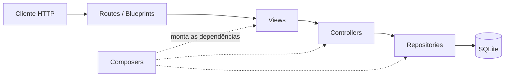
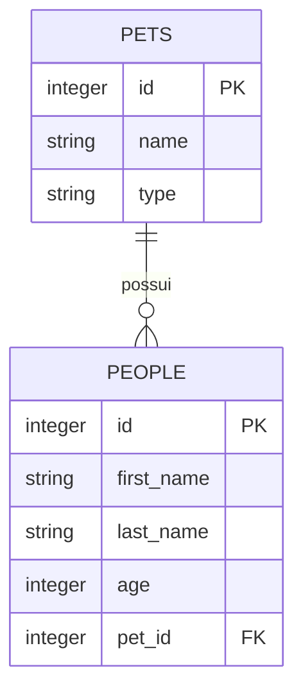

<div align="center">

# 🐾 Rocket Pets API

API REST para gerenciar pessoas e pets, construída para colocar em prática uma arquitetura MVC em Python.

[](https://www.python.org/)
[](https://flask.palletsprojects.com/)
[](https://www.sqlalchemy.org/)
[](https://pytest.org/)

</div>

## Sobre o projeto

O **Rocket Pets** é um projeto de estudo que expõe uma API HTTP para cadastrar e consultar pessoas, listar pets e remover um pet pelo nome. A aplicação separa responsabilidades entre rotas, views, controllers e repositories, usando composers para montar as dependências de cada caso de uso.

O projeto também inclui validação de entrada com Pydantic, persistência em SQLite por meio do SQLAlchemy, tratamento centralizado de erros e testes unitários com mocks.

## Funcionalidades

- Cadastro de pessoas vinculadas a um pet
- Consulta de uma pessoa pelo identificador
- Listagem de todos os pets
- Exclusão de um pet pelo nome
- Validação do corpo das requisições
- Respostas HTTP padronizadas
- CORS habilitado para integração com clientes externos
- Testes de controllers, repositories, validators e conexão

## Arquitetura



| Camada | Responsabilidade |
| --- | --- |
| **Routes** | Receber a requisição Flask e devolver a resposta HTTP |
| **Views** | Adaptar dados HTTP e definir o status da resposta |
| **Controllers** | Executar as regras de negócio e formatar os dados de saída |
| **Repositories** | Consultar e alterar os dados persistidos |
| **Composers** | Criar e conectar as dependências de cada fluxo |
| **Validators** | Validar os dados recebidos antes do caso de uso |

## Tecnologias

- Python
- Flask e Flask-CORS
- SQLAlchemy
- SQLite
- Pydantic
- Pytest, pytest-mock e mock-alchemy

## Como executar

### Pré-requisitos

- Python 3.10 ou superior
- Git

### 1. Clone o repositório

```bash
git clone https://github.com/9Brunodox/mvc_rocket_pets.git
cd mvc_rocket_pets
```

### 2. Crie e ative um ambiente virtual

No Windows:

```powershell
python -m venv .venv
.\.venv\Scripts\Activate.ps1
```

No Linux ou macOS:

```bash
python3 -m venv .venv
source .venv/bin/activate
```

### 3. Instale as dependências

```bash
python -m pip install -r requirements.txt
```

### 4. Inicie a API

```bash
python app.py
```

A aplicação ficará disponível em `http://localhost:3000`.

> O repositório já inclui o arquivo `storage.db` com as tabelas criadas e cinco pets para experimentação. O script SQL usado para criar essa estrutura está em `init/schema.sql`.

## Endpoints

| Método | Rota | Descrição | Sucesso |
| --- | --- | --- | --- |
| `POST` | `/people` | Cadastra uma pessoa | `201 Created` |
| `GET` | `/people/{person_id}` | Busca uma pessoa e o tipo de seu pet | `200 OK` |
| `GET` | `/pets` | Lista os pets cadastrados | `200 OK` |
| `DELETE` | `/pets/{name}` | Remove um pet pelo nome | `204 No Content` |

### Cadastrar uma pessoa

```bash
curl --request POST http://localhost:3000/people \
  --header "Content-Type: application/json" \
  --data '{
    "first_name": "Maria",
    "last_name": "Silva",
    "age": 28,
    "pet_id": 2
  }'
```

Resposta:

```json
{
  "data": {
    "type": "person",
    "count": 1,
    "attributes": {
      "first_name": "Maria",
      "last_name": "Silva",
      "age": 28,
      "pet_id": 2
    }
  }
}
```

Os campos `first_name` e `last_name` são obrigatórios e aceitam apenas letras de `A` a `Z`. `age` e `pet_id` devem ser números inteiros.

### Buscar uma pessoa

```bash
curl http://localhost:3000/people/1
```

Resposta:

```json
{
  "data": {
    "type": "person",
    "count": 1,
    "attributes": {
      "first_name": "Maria",
      "last_name": "Silva",
      "age": 28,
      "pet_id": 2,
      "pet_type": "cat"
    }
  }
}
```

### Listar pets

```bash
curl http://localhost:3000/pets
```

Resposta:

```json
{
  "data": {
    "type": "pets",
    "count": 5,
    "attributes": [
      {
        "id": 1,
        "name": "cobra",
        "type": "snake"
      }
    ]
  }
}
```

### Excluir um pet

```bash
curl --request DELETE http://localhost:3000/pets/hamster
```

A remoção bem-sucedida retorna o status `204 No Content`, sem corpo de resposta.

## Estrutura de pastas

```text
.
├── app.py                     # Ponto de entrada da aplicação
├── init/
│   └── schema.sql            # Estrutura e dados iniciais do banco
├── src/
│   ├── controllers/          # Regras de negócio
│   ├── errors/               # Erros e tratamento HTTP
│   ├── main/
│   │   ├── composer/         # Montagem das dependências
│   │   ├── routes/           # Endpoints da API
│   │   └── server/           # Configuração do Flask
│   ├── models/sqlite/        # Entidades, interfaces e repositories
│   ├── validators/           # Validação de entrada
│   └── views/                # Adaptação entre HTTP e controllers
├── tests/                     # Testes automatizados
├── requirements.txt
└── storage.db                 # Banco SQLite local
```

## Testes

Com o ambiente virtual ativo e as dependências instaladas, execute:

```bash
python -m pytest -q
```

Alguns testes de integração com o banco estão marcados para serem ignorados por padrão. A suíte também exercita as regras de negócio, a validação e o acesso a dados com objetos simulados.

## Modelo de dados



---

<div align="center">
  Desenvolvido como parte dos estudos de Python e arquitetura MVC na Rocketseat.
</div>
